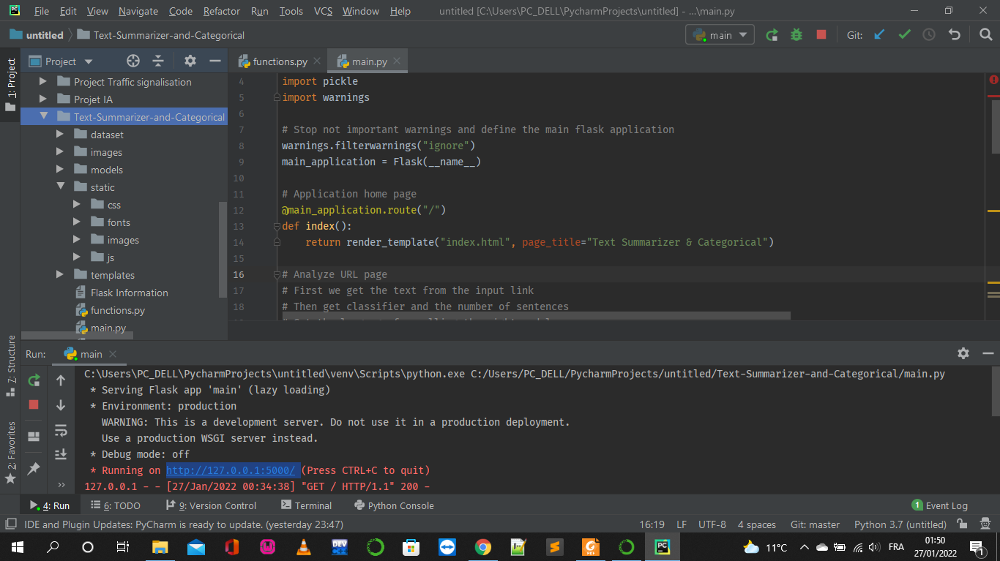
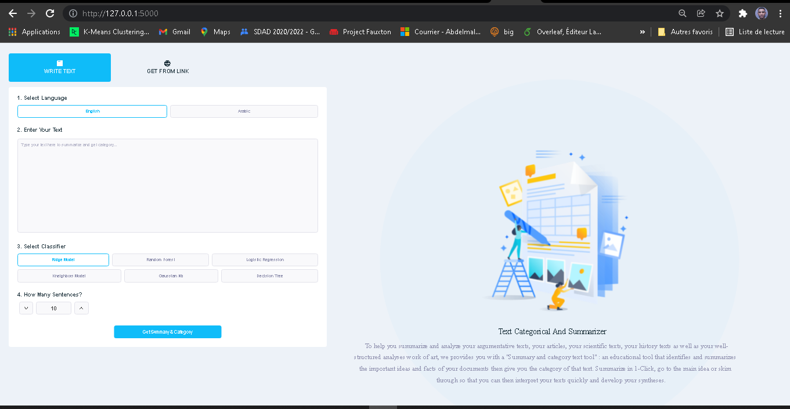
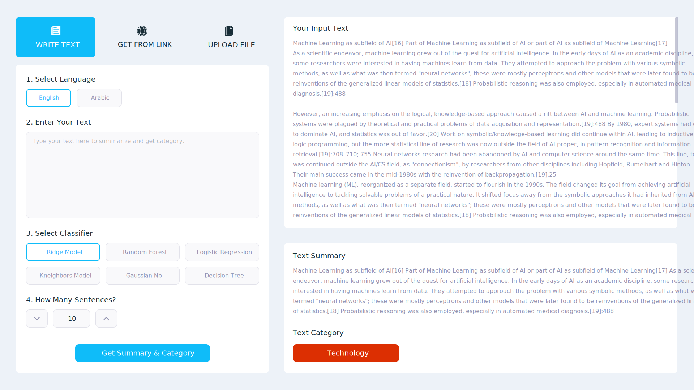

<h1>
Rapport Projet Data Mining: 
</h1> 
<h2>
 Realization of a web application for the automatic text summary 
</h2>
<h3>
 Automatic Text Summarization and Categorization 
<h3>

<h1>Introduction</h1>
Summarization is the task of condensing a piece of text to a shorter version, reducing the size of the initial text while at the same time preserving key informational elements and the meaning of content. Since manual text summarization is a time expensive and generally laborious task, the automatization of the task is gaining increasing popularity and therefore constitutes a strong motivation for academic research. Automatic text summarization is a common problem in machine learning and natural language processing (NLP).

<h1>Natural Language Processing (NLP)</h1>
Natural Language Processing is the technology used to aid computers to understand the human’s natural language. It’s not an easy task teaching machines to understand how we communicate. Natural Language Processing which usually shortened as NLP, is a branch of artificial intelligence that deals with the interaction between computers and humans using the natural language. The ultimate objective of NLP is to read, decipher, understand, and make sense of the human languages in a manner that is valuable.

# Résultats d'éxection:

## Usage
To run this project make sure you have the required installation of Python, NLTK with it's data, pandas, Scikit-learn, and Flask framework then follow the steps given below:
- Run the  main.py  file to start Flask server and use the application.
- You don't need to train classification models on your own. I have trained all model and saved it in the dictionary  models , but you have the datasets in dataset  directory.

## Graphical User Interface
The graphical user interface (GUI) is the point of human-computer interaction and communication in a device. This can include display screens, keyboards, a mouse and the appearance of a desktop. It is also the way through which a user interacts with an application or a website. The GUI of this application builded using web languages like  HTML, CSS ,javascrip and Flask Framework and this is how it look like:

## Test the website
After reading the input text and the number of sentences from the user and getting the model name and the language, then pass that information to the main function that apply the text summarization and get the right category .

